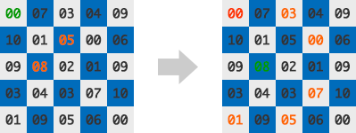
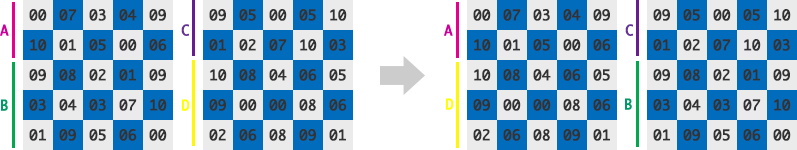
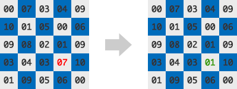
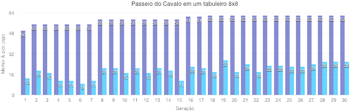
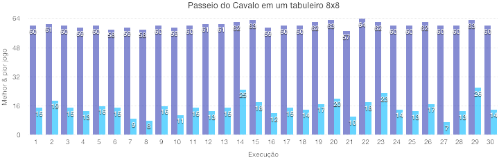

<dl>
<p><strong>
CENTRO FEDERAL DE EDUCAÇÃO TECNOLÓGICA DE MINAS GERAIS<br>
ENGENHARIA DE COMPUTAÇÃO<br>
LABORATÓRIO DE INTELIGÊNCIA ARTIFICIAL<br>
Prof. Flávio Cruzeiro<br>

<p>2016-1</p>
</strong></p>
</dl>

### TP3: Algoritmo Genético aplicado ao problema do Passeio do Cavalo
**por Pedro Felipe Froes e Saulo Antunes**

---

O problema do Passeio do Cavalo consiste em codificar um algoritmo que encontre um caminho em um tabuleiro de xadrez pelo qual a peça do Cavalo passe por todas as suas casas, passando apenas uma única vez por cada uma delas. No xadrez, o Cavalo faz um movimento em _L_ a partir de sua posição inicial, pulando sobre quaisquer outras pessoas até o final do movimento.

Uma maneira recorrente para a solução do problema do Cavalo é a utilização de algoritmos de força bruta, através de _backtracking_. Existem aproximadamente 4x10<sup>51</sup> sequências de movimentos possíveis em um tabuleiro 8x8, porém esses algoritmos tornam-se ineficientes à medida que o tamanho do tabuleiro aumenta.

Para tentar resolver o problema, foi implementado um Algoritmo Genético contemplando as operações de seleção, pareamento, _crossover_ e mutação através de uma Função Objetivo a fim de gerar populações até encontrar uma solução adequada. Execuções do algoritmo foram realizadas para diversos tamanhos de tabuleiros (5x5, 8x8, 16x16, etc., até 1024x1024), cujos resultados foram posteriormente analisados.

#### Codificação do problema

O algoritmo foi construído em cima de três parâmetros principais: o número de gerações (determina a quantidade de vezes que o algoritmo será executado), o tamanho da população (número de indíviduos a cada população) e o tamanho do tabuleiro. Cada indivíduo foi codificado na forma de um `Game`, cujos atributos são:

* `moves`, a quantidade de movimentos realizada até o momento;
* `path`, o caminho do indivíduo pelo tabuleiro;
* `table`, cria um tabuleiro de prioridade de movimentos;
* `position`, sua posição inicial;
* `table[x][y]`, sua tabela de posições visitadas no tabuleiro.

Um dos princípais atributos do indivíduo é seu tabuleiro de prioridade de movimentos. Cada indvíduo possui um tabuleiro com tamanho equivalente ao tabuleiro do problema, onde cada casa possui um valor de prioridade randômico definido entre 0 e 10. Para escolher qual será sua próxima casa a ser visitada, o indivíduo seleciona primeiramente aquelas cujo movimento é válido (ou seja, correspondem ao _L_ do Cavalo), e posteriormente a casa de maior prioridade analisada primeiro. Ambas decisões são realizadas através dos métodos `nextMoves` e `getBestMove`, respectivamente.



_Figura 1: Escolha do movimento do Cavalo._

A figura acima exemplifica o processo de decisão do próximo movimento de um indivíduo, mostrando seu tabuleiro de prioridades. No tabuleiro da esquerda, o Cavalo se encontra inicialmente na posição `(0,0)` (em verde), e os movimentos possíveis obtidos através do `nextMoves` são representados em laranja. Cabe ao `getBestMove` analisar qual a casa de maior prioridade dentre as selecionadas previamente - no caso, a posição `(3,2)` é selecionada, e a quantidade de movimentos `moves` é incrementada em 1. Na figura da direita, o Cavalo encontra-se na posição seguinte (em verde), e as possíveis posições são mostradas também em laranja. É válido reparar que sua posição anterior, `(0,0)`, não é um movimento possível, pois está já presente na tabela de posições visitadas pelo indivíduo.

O processo descrito no parágrafo acima é implementado no método `play`, e executado até o indíviduo não obter nenhum movimento possível em sua lista de `nextMoves`, parando de incrementar `moves`. Entretanto, esse processo é influenciado pelas operações inerentes aos Algoritmos Genéticos: seleção, pareamento, _crossover_ e mutação, descritas a seguir.

###### Implementação do Algoritmo Genético

Com o processo de decisão de movimentos codificado, é possível iniciar, de fato, a implementação do Algoritmo Genético para a resolução do problema. Para exemplificar como foi realizada sua codificação, será descrito todo o processo de uma iteração do algoritmo para uma população de tamanho 30.

Inicialmente, 30 indíviduos são gerados, cada um com um tabuleiro de prioridades gerado de maneira aleatória. Cada indivíduo executa um jogo através do método `play`, e, ao final de cada jogo, o número de movimentos alcançados é armazenado na variável `moves` de cada um deles.

A operação de **seleção** é implementada no método `getBestGame` e verificará qual indivíduo possui o maior valor de `moves` dentre os 30. Ou seja, a **Função Objetivo** desse algoritmo é baseada em qual indivíduo consegue realizar o maior caminho pelo tabuleiro sem repetir posições. Para fins de análise de resultados, há também um método que, diferentemente do anterior, armazena o pior jogo.

O **pareamento** é então aplicado à população, de modo que o indivíduo 1 é pareado com o 15, o 2 com 16, o 3 com 17, e assim por diante até parear o indivíduo 14 com o 30. Agora pareados, ocorre a operação de **_crossover_**, mostrada na figura a seguir.



_Figura 2: Operação de_ crossover.

O _crossover_ dos indivíduos a direita gera outros dois indivíduos _filhos_ a esquerda, ambos possuindo características mescladas dos seus _pais_. A operação de _crossver_ se dá mesclando o tabuleiro de prioridades de ambos indivíduos, gerando assim dois novos indivíduos com dois novos tabuleiros de prioridade. Ao final dessa etapa, a população será dobrada.

A **mutação** tem uma chance aleatória de ocorrer sobre os indivíduos da população. O indivíduo afetado por ela tem algum valor de seu tabuleiro de prioridade alterado randomicamente, conforme mostrado na figura abaixo.



_Figura 3: Operação de mutação_

Na Figura 3, a posição `(4,4)` do tabuleiro de prioridades de um indivíduo é selecionada aleatoriamente, e tem seu valor alterado de 7 para 1 também de forma aleatória.

Após todas as operações anteriores, dos 60 indivíduos da população, 30 são selecionados de forma aleatória, formando uma nova população. Entretanto, foi decidido aplicar o elitismo e garantiu-se que o melhor jogo da população anterior esteja presente na nova população. Portanto, o indivíduo oriundo do método `getBestGame` estará presente na próxima iteração do algoritmo.

O algoritmo vai iterar até um número de gerações previamente determinado. Em sua última geração, o problema pode ou não ter sido resolvido, mostrando o melhor e pior indivíduo de cada população.

#### Análise dos resultados

O algoritmo pode ser executado considerando diferentes números de gerações, tamanhos de tabuleiros e populações. Inicialmente, considerou-se o número de gerações como 30, e executou-se o algoritmo uma única vez em um tabuleiro 8x8 para uma população de 60 indivíduos, obtendo o resultado a seguir:



_Figura 4: Aplicação do algoritmo em um tabuleiro 8x8, com os melhores indivíduos em roxo e os piores em azul._

```
Priority Table
  8   5   4   2   7   4   9   9 
 10   1   2   4   1   6   2  10 
  7   7   8   2   3   6  10   7 
  7   9   0   7   0   4   0   1 
  8   8   6   2   5   3   1   4 
 10   5   5   6   6   3   8   3 
  8   8   3   5   3   9   7   3 
  8   8   5   9   3   9   0   7
  
Table
  1  50  23  62  25  28  33  30 
 22  61  52  49  34  31   0  27 
 51   2  21  24  53  26  29  32 
 20  15  60  11  48  35  58   0 
  3  12  19  54  59  38  47  36 
 16  41  14  39  10  45   8  57 
 13   4  43  18  55   6  37  46 
 42  17  40   5  44   9  56   7 
```

Acima, é possível conferir o tabuleiro de prioridade do melhor jogo, bem como as posições visitadas por ele. A posição inicial do Cavalo é codificada para ser sempre a `(0,0)`, que na tabela de visitados tem valor 1. É possível refazer o caminho seguindo apenas seguindo a ordem das visitas: 1, 2, 3, etc. Através do resultado acima, pode-se perceber algumas características do algoritmo:

* Para essa execução do algoritmo, ele não consegue encontrar uma solução para o problema, porém chega próximo a uma com um indivíduo com 62 movimentos (sendo 64 a solução).
* Apesar de não encontrar a solução, é perceptível que a população tende a melhorar a cada geração. Enquanto os valores dos melhores jogos só aumentam, os valores dos piores têm um comportamento mais variável. Isso se deve à habilidade dos piores indivíduos da geração `n` de poderem ir para a geração `n+1`, além de não haver garantia que as operações de _crossover_ e mutação sempre gerem indivíduos melhores que na geração anterior. Entrentanto, é perceptível que ainda há uma leve tendência de melhora nos piores indivíduos, com a primeira geração tendo um `worstGame` de 10, e a trigésima de 24.
* Pode-se relacionar ainda o tamanho da população com o comportamento dos piores jogos: a medida que a população aumenta, a variação dos piores jogos também aumenta. Isso ocorre porque uma maior população implica em maior randomicidade do algoritmo, dando espaço para que os piores jogos sejam substituídos aleatoriamente por jogos piores ou melhores que ele próprio.
* A melhora dos melhores indivíduos ocorre de maneira quase exponencial: no começo do algoritmo há uma taxa de melhoria mais rápida do valor de `bestGame`, que vai diminuindo até a última geração.

Três fatores são determinantes na análise do sucesso do algoritmo: o número de gerações, o tamanho da população e a randomicidade de cada execução. Para um tabuleiro 8x8, 30 mostrou-se um valor pequeno como número de gerações – é possível que o algoritmo encontrasse a resposta iterasse mais vezes. Além disso, executando o algoritmo novamente, a resposta será diferente da representada anteriormente. De fato, a cada execução, a chance de que as resposta do algoritmo seja equivalente a anterior é mínima, dado que os tabuleiros de prioridades para cada indivíduo, bem como as operações de mutação, têm natureza aleatória. Portanto, aumentando o número de indvíduos e de gerações, aumenta-se também a chance de que um dos indivíduos contribua aleatoriamente para encontrar a solução do problema.

A seguir, foi executado o algoritmo 30 vezes ainda para um tabuleiro 8x8, com cada execução considerando 30 gerações e mantendo a população com 60 indivíduos. Uma análise gráfica das execuções é mostrada a seguir, com o melhor e pior jogo da trigésima geração de cada uma das 30 execuções sendo comparadas.



_Figura 5: 30 execuções em um tabuleiro 8x8, melhor e pior jogo de cada execução são mostrados em roxo e azul, respectivamente._

|                                     | Valor   |
| ----------------------------------- | ------- |
| **Melhor valor da Função Objetivo** | 64      |
| **Média do melhor jogo**            | 60.2627 |
| **Desvio padrão do melhor jogo**    | 1.8182  |
| **Média do pior jogo**              | 18.0333 |
| **Desvio padrão do pior jogo**      | 5.5241  |

_Tabela 1: Estatísticas referentes à Figura 5._

Nas execuções acima, a solução é encontrada uma única vez, durante a execução 27. Entretanto, os valores de melhor jogo ainda chegam próximos à solução, tendo uma média de aproximadamente 60. Os piores jogos também demonstraram um comportamento mais variável, com desvio padrão de 5.5 e média 18.

Outras execuções do algoritmo foram realizadas, considerando agora diferentes tamanhos de tabuleiros, com o número de gerações e o tamanho da população fixados em 30. Foram realizadas 5 execuções do algoritmo quando possível, e o tempo computacional e os melhores valores da Função Objetivo para cada tamanho de tabuleiro são mostrados a seguir.

|               | **Solução** | **Função Objetivo** | **Tempo computacional** | 
| ------------- | ----------- | ------------------- | ----------------------- |
| **5x5**       | 25          | 25                  | 1.6424 s                |
| **8x8**       | 64          | 64                  | 3.6280 s                |
| **16x16**     | 256         | 227                 | 12.2946 s               |
| **32x32**     | 1024        | 802                 | 42.6225 s               |
| **64x64**     | 4096        | 2212                | 116.7376 s              |
| **128x128**   | 16384       | 8086                | 268.7959 s              |
| **256x256**   | 65536       | 10978**#**          | 611.8807 s              |
| **512x512**   | 262144      | 14552**#**          | 1785.8068 s             |
| **1024x1024** | 1048576     | *                   | *                       |

_Tabela 2: Estatísticas referentes à execução em diversos tamanhos de tabuleiros. O # ao lado do valor mostra que não foram realizadas 5 execuções do algoritmo devido ao tempo gasto, enquanto o * denota que não foi possível obter o valor devido ao alto tempo computacional que a solução requer._

A medida que o tamanho do tabuleiro aumenta, o tempo de solução aumenta exponencialmente, enquanto os melhores valores da Função Objetivo para as cinco execuções caem drasticamente. Uma maneira de aumentar esses valores é aumentar o número de gerações de acordo com o tamanho do tabuleiro – isso é, tabuleiros maiores devem iterar por mais gerações que os demais. Entretanto, isso também aumentaria bastante o tempo computacional gasto por execução de cada algoritmo.

#### Conclusão

O Algoritmo Genético não é um algoritmo adequado para a resolução do problema do Passeio do Cavalo. O seu alto teor de randomicidade, que mostra-se em sua dependência nas operações de _crossover_ e mutação para encontrar uma solução, é o principal fator pelo qual o mesmo não é uma fonte confiável para a solução do problema. Embora algoritmos de força bruta possam gastar mais tempo computacional na solução, eles possuem uma maior confiabilidade que o resultado será encontrado, o que geralmente é preferencial para a resolução do problema.

#### Referências

* [Passeio do Cavalo na Wikipedia](https://en.wikipedia.org/wiki/Knight%27s_tour "Knight's Tour")
* [Artigo sobre a aplicação do Algoritmo Genético no problema do Passeio do Cavalo](http://citeseerx.ist.psu.edu/viewdoc/download?rep=rep1&type=pdf&doi=10.1.1.115.3709)
